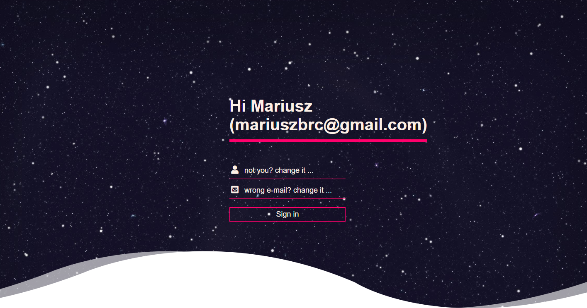
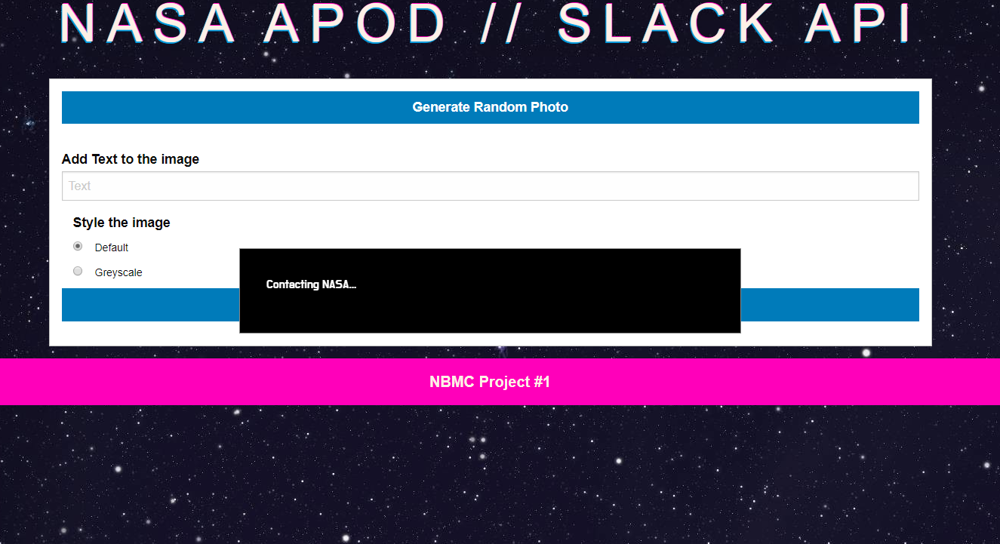
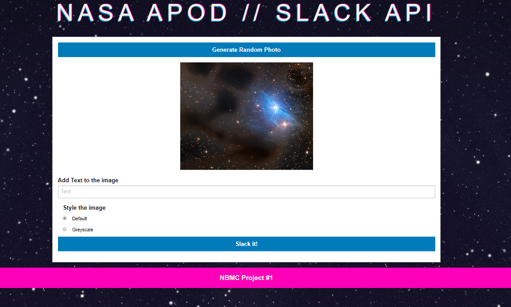
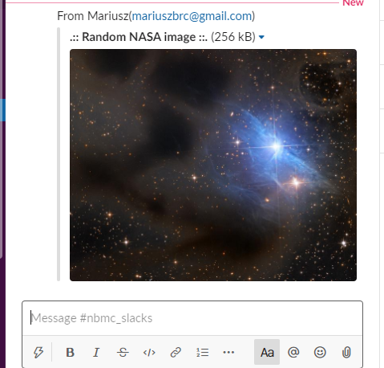

# Slack generator

Sends message and image to the Slack channel.

Website Here: https://borucltd.github.io/patient0/

## Getting Started

Open the web browser, provide your name and email address. These will be saved in the local storage.
Next, click generate an image and wait for the random image to be displayed. Once it is there you can Slack using Slack it button.
You can also add text to the image and change it to greyscale.

Please note, due to CORS we were not able to easily transfer image with a text to Slack.

## Prerequisities

You just need a web browser. The project was tested on:
* desktop Chrome/Firefox
* mobile Chrome/Firefox 

### Example

* login page

* generate image

* generated image

* message and image on slack

### Built with

To build this project we used:
* Foundation
* Custom CSS
* JavaScript
* Jquery
* local storage
* two  APIs: https://api.slack.com/ and https://api.nasa.gov/.
